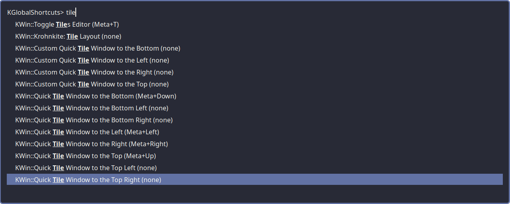

# kshortcut-rofi
Ever wanted to see what shortcuts are available, or knew what you wanted but
not the shortcut? This is the tool for you.

This is a rofi launcher that displays all KDE shortcuts and optionally launches them.

Personally, I launch this via 
`python3 /path/to/kshortcut-rofi.py` and that's enough for me.

Packagers are welcomed.

There's no dependencies to the Python script itself.

## Screenshot

## Dependencies
* rofi
* qdbus